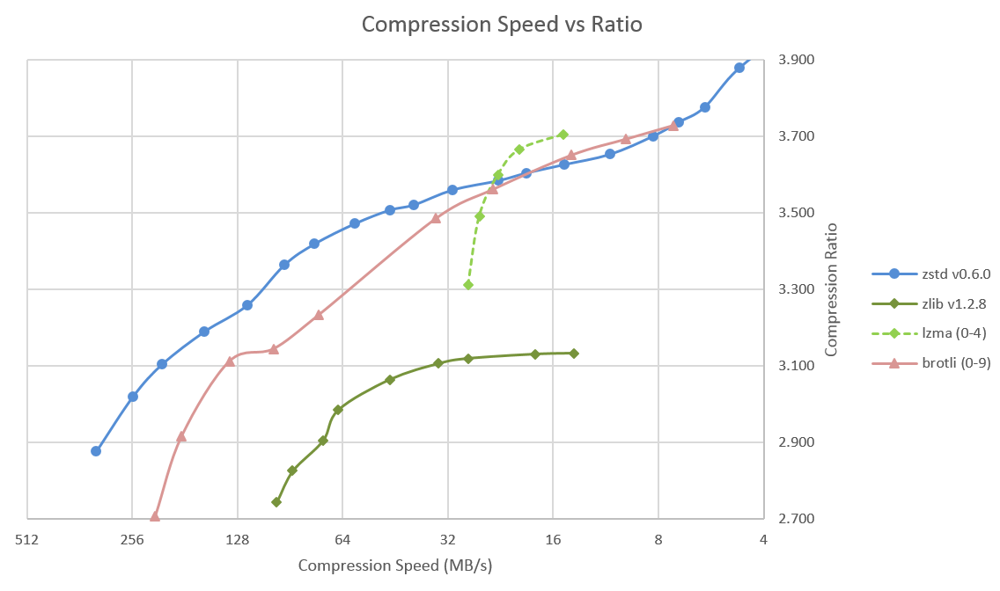
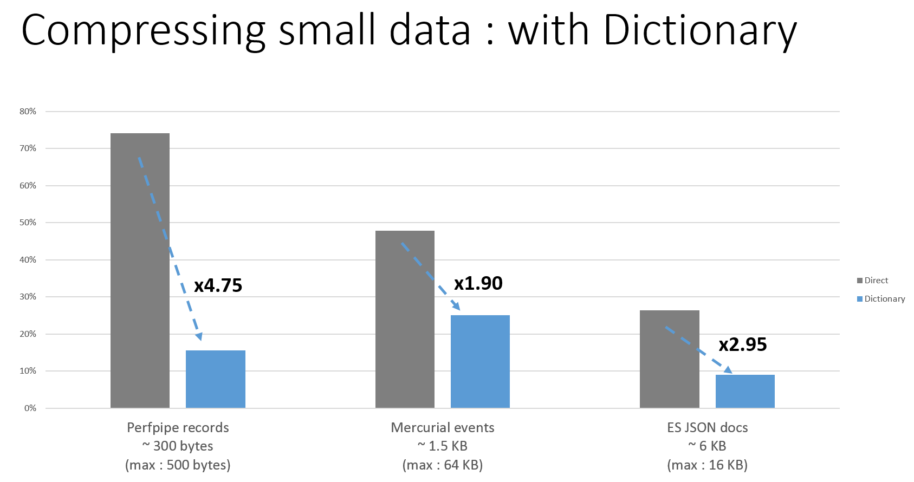

 **Zstd**, short for Zstandard, is a fast lossless compression algorithm, targeting real-time compression scenarios at zlib-level and better compression ratios.

It is provided as a BSD-license package, hosted on Github.

|Branch      |Status   |
|------------|---------|
|master      |  |
|dev         |  |

As a reference, several fast compression algorithms were tested and compared on a Core i7-3930K CPU @ 4.5GHz, using [lzbench], an open-source in-memory benchmark by @inikep compiled with gcc 5.2.1, with the [Silesia compression corpus].

[lzbench]: https://github.com/inikep/lzbench
[Silesia compression corpus]: http://sun.aei.polsl.pl/~sdeor/index.php?page=silesia

|Name             | Ratio | C.speed | D.speed |
|-----------------|-------|--------:|--------:|
|                 |       |   MB/s  |  MB/s   |
|**zstd 0.7.0 -1**|**2.877**|**325**| **930** |
| [zlib] 1.2.8 -1 | 2.730 |    95   |   360   |
| brotli -0       | 2.708 |   220   |   430   |
| QuickLZ 1.5     | 2.237 |   510   |   605   |
| LZO 2.09        | 2.106 |   610   |   870   |
| [LZ4] r131      | 2.101 |   620   |  3100   |
| Snappy 1.1.3    | 2.091 |   480   |  1600   |
| LZF 3.6         | 2.077 |   375   |   790   |

[zlib]:http://www.zlib.net/
[LZ4]: http://www.lz4.org/

Zstd can also offer stronger compression ratios at the cost of compression speed.
Speed vs Compression trade-off is configurable by small increment. Decompression speed is preserved and remain roughly the same at all settings, a property shared by most LZ compression algorithms, such as [zlib] or lzma.

The following tests were run on a Core i7-3930K CPU @ 4.5GHz, using [lzbench], an open-source in-memory benchmark by @inikep compiled with gcc 5.2.1, on the [Silesia compression corpus].

Compression Speed vs Ratio | Decompression Speed
---------------------------|--------------------
 | 

Several algorithms can produce higher compression ratio but at slower speed, falling outside of the graph.
For a larger picture including very slow modes, [click on this link](images/DCspeed5.png) .

### The case for Small Data compression

Previous charts provide results applicable to typical files and streams scenarios (several MB). Small data come with different perspectives. The smaller the amount of data to compress, the more difficult it is to achieve any significant compression.

This problem is common to any compression algorithm. The reason is, compression algorithms learn from past data how to compress future data. But at the beginning of a new file, there is no "past" to build upon.

To solve this situation, Zstd offers a __training mode__, which can be used to tune the algorithm for a selected type of data, by providing it with a few samples. The result of the training is stored in a file called "dictionary", which can be loaded before compression and decompression. Using this dictionary, the compression ratio achievable on small data improves dramatically :

These compression gains are achieved while simultaneously providing faster compression and decompression speeds.

Dictionary work if there is some correlation in a family of small data (there is no _universal dictionary_).
Hence, deploying one dictionary per type of data will provide the greater benefits. Dictionary gains are mostly effective in the first few KB. Then, the compression algorithm will rely more and more on previously decoded content to compress the rest of the file.

#### Dictionary compression How To :

##### _Using the Command Line Utility_ :

1) Create the dictionary

`zstd --train FullPathToTrainingSet/* -o dictionaryName`

2) Compress with dictionary

`zstd FILE -D dictionaryName`

3) Decompress with dictionary

`zstd --decompress FILE.zst -D dictionaryName`

### Status

Zstd compression format has reached "Final status". It means it is planned to become the official stable zstd format and be tagged `v1.0`. The reason it's not yet tagged `v1.0` is that it currently performs its "validation period", making sure the format holds all its promises and nothing was missed.
Zstd library also offers legacy decoder support. Any data compressed by any version >= `v0.1` (hence including current one) remains decodable now and in the future.
The library has been validated using strong [fuzzer tests](https://en.wikipedia.org/wiki/Fuzz_testing), including both [internal tools](programs/fuzzer.c) and [external ones](http://lcamtuf.coredump.cx/afl). It's able to withstand hazard situations, including invalid inputs.
As a consequence, Zstandard is considered safe for, and is currently used in, production environments.

### Branch Policy

The "dev" branch is the one where all contributions will be merged before reaching "master". If you plan to propose a patch, please commit into the "dev" branch or its own feature branch. Direct commit to "master" are not permitted.

### Miscellaneous

Zstd entropy stage is provided by [Huff0 and FSE, from Finite State Entropy library](https://github.com/Cyan4973/FiniteStateEntropy).
