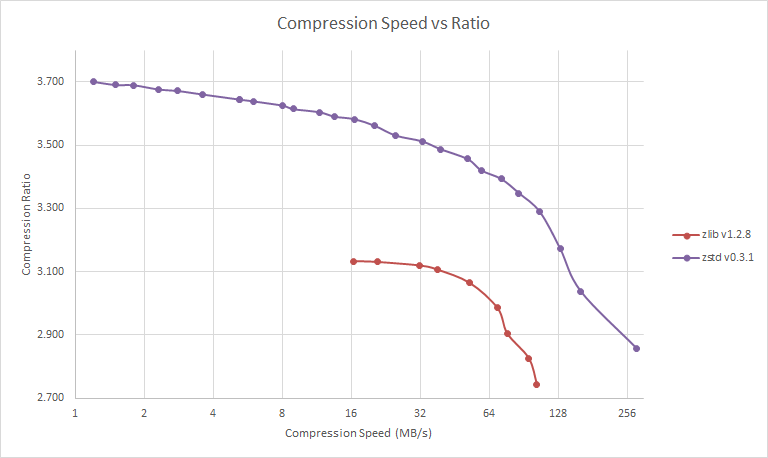
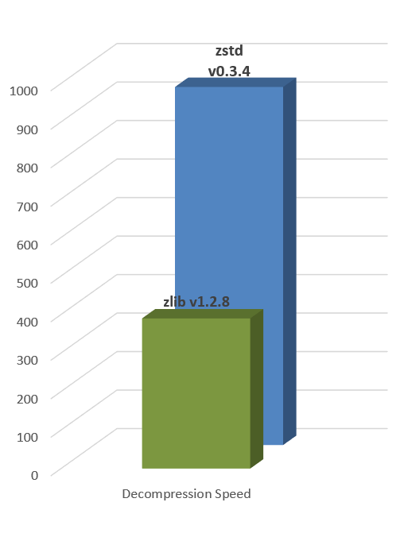

 **Zstd**, short for Zstandard, is a fast lossless compression algorithm, targeting real-time compression scenarios at zlib-level compression ratio.

It is provided as a BSD-license package, hosted on Github.

|Branch      |Status   |
|------------|---------|
|master      |  |
|dev         |  |

For a taste of its performance, here are a few benchmark numbers from a number of compression codecs suitable for real-time. The test was completed on a Core i7-5600U @ 2.6 GHz, using [fsbench 0.14.3](http://encode.ru/threads/1371-Filesystem-benchmark?p=34029&viewfull=1#post34029), an open-source benchmark program by m^2.

|Name             | Ratio | C.speed | D.speed |
|-----------------|-------|--------:|--------:|
|                 |       |   MB/s  |  MB/s   |
| **zstd 0.3**    |**2.858**|**280**| **670** |
| [zlib] 1.2.8 -1 | 2.730 |    70   |   300   | 
| QuickLZ 1.5.1b6 | 2.237 |   370   |   415   |
| LZO 2.06        | 2.106 |   400   |   580   |
| [LZ4] r131      | 2.101 |   450   |  2100   |
| Snappy 1.1.0    | 2.091 |   330   |  1100   |
| LZF 3.6         | 2.077 |   200   |   560   |

[zlib]:http://www.zlib.net/
[LZ4]:http://www.lz4.org/

Zstd can also offer stronger compression ratio at the cost of compression speed. Compression speed is highly configurable, by small increment, to fit different situations. Note however that decompression speed is preserved and remain roughly the same at all settings, a property shared by most LZ compression algorithms, such as [zlib]. The following test is run on a Core i7-3930K CPU @ 4.5GHz, using [lzbench], an open-source in-memory benchmark by inikep.

[lzbench]:https://github.com/inikep/lzbench

Zstd entropy stage is provided by [Huff0 and FSE, from Finite State Entrop library](https://github.com/Cyan4973/FiniteStateEntropy).

Its memory requirement can also be configured to fit into low-memory hardware configurations, or servers handling multiple connections/contexts in parallel.

Zstd has not yet reached "stable format" status. It doesn't guarantee yet that its current compressed format will remain stable and supported in future versions. During this period, it can still change to adapt new optimizations still being investigated. "Stable Format" is projected sometimes early 2016. 

That being said, the library is now fairly robust, able to withstand hazards situations, including invalid inputs. The library reliability has been tested using [Fuzz Testing](https://en.wikipedia.org/wiki/Fuzz_testing), with both [internal tools](programs/fuzzer.c) and [external ones](http://lcamtuf.coredump.cx/afl). Therefore, it seems now safe to test Zstandard even within production environments.

### Branch Policy
The "dev" branch is the one where all contributions will be merged before reaching "master". If you plan to propose a patch, please commit into the "dev" branch or its own feature branch. Direct commit to "master" are not permitted.
