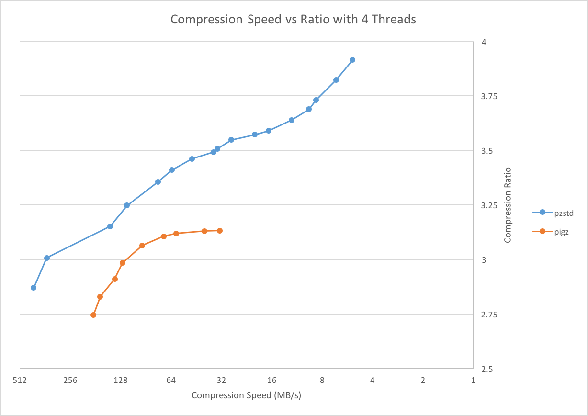

# Parallel Zstandard (PZstandard)

Parallel Zstandard provides Zstandard format compatible compression and decompression that is able to utilize multiple cores.
It breaks the input up into equal sized chunks and compresses each chunk independently into a Zstandard frame.
It then concatenates the frames together to produce the final compressed output.
Optionally, with the `-p` option, PZstandard will write a 12 byte header for each frame that is a skippable frame in the Zstandard format, which tells PZstandard the size of the next compressed frame.
When `-p` is specified for compression, PZstandard can decompress the output in parallel.

## Usage

Basic usage

    pzstd input-file -o output-file -n num-threads [ -p ] -#   # Compression
    pzstd -d input-file -o output-file -n num-threads          # Decompression

PZstandard also supports piping and fifo pipes

    cat input-file | pzstd -n num-threads [ -p ] -# -c > /dev/null

For more options

    pzstd --help

## Benchmarks

As a reference, PZstandard and Pigz were compared on an Intel Core i7 @ 3.1 GHz, each using 4 threads, with the [Silesia compression corpus](http://sun.aei.polsl.pl/~sdeor/index.php?page=silesia).

Compression Speed vs Ratio with 4 Threads | Decompression Speed with 4 Threads
------------------------------------------|-----------------------------------
 | 

The test procedure was to run each of the following commands 2 times for each compression level, and take the minimum time.

    time ./pzstd -# -n 4 -p -c silesia.tar > silesia.tar.zst
    time ./pzstd -d -n 4    -c silesia.tar.zst > /dev/null

    time pigz    -# -p 4 -k -c silesia.tar > silesia.tar.gz
    time pigz    -d -p 4 -k -c silesia.tar.gz > /dev/null

PZstandard was tested using compression levels 1-19, and Pigz was tested using compression levels 1-9.
Pigz cannot do parallel decompression, it simply does each of reading, decompression, and writing on separate threads.

## Tests

Tests require that you have [gtest](https://github.com/google/googletest) installed.
Modify `GTEST_INC` and `GTEST_LIB` in `test/Makefile` and `utils/test/Makefile` to work for your install of gtest.
Then run `make test` in the `contrib/pzstd` directory.
